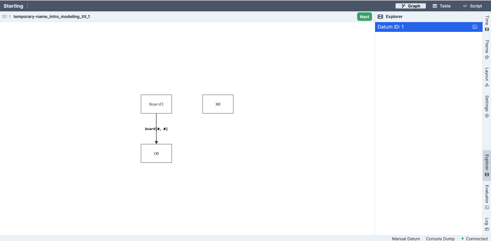
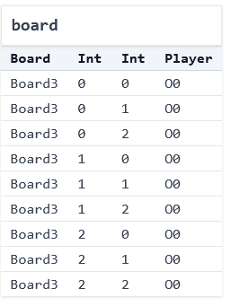

# Introduction to Modeling (Part 1)

<!-- FLOW:
  - Monday: get to boards, wellformed, winning
  - Wednesday: get to at least one possible move predicate, initial state
  - Friday: steps -- do we want to do finite traces yet or not? -->

<!-- **TODO: preamble on modeling from docs; there's a lot of overlap with the docs actually** --> 

Today's livecode is [here](./intro_modeling_ttt_1.frg).

## Tools, Documentation, and Supplemental Reading

We'll be using the [Forge](https://docs.google.com/document/d/1EBlnRyujtkrfrYBhRRl88bMzgrSiF_NEtDU1Mcfvsh0/pub) declarative modeling language for this course. Forge is a "lightweight" modeling tool. Lightweight techniques tend to eschew full formalization and embrace some partiality (see [Jackson and Wing](https://www.cs.cmu.edu/~wing/publications/JacksonWing96.pdf)) in exchange for cost-effectiveness, agility, and other benefits. As [Bornholt, et al.](https://www.amazon.science/publications/using-lightweight-formal-methods-to-validate-a-key-value-storage-node-in-amazon-s3) write in their recent paper, a lightweight approach "do(es) not aim to achieve full formal verification, but instead emphasize(s) automation, usability, and the ability to continually ensure correctness as both software and its specification evolve over time."

This week will be a sort of "whirlwind tour" of Forge. We'll cover more in future classes; you can also access the [Forge documentation](https://csci1710.github.io/forge-documentation/). 

### Forge Updates

We'll be updating Forge regularly; **expect an update roughly every week**. Sometimes we may update more often to resolve issues, etc. or less often if no changes are needed. Updates will be announced on EdStem, and each update will have a new version number. **Please keep Forge updated** and include your version number in questions or bug reports.

## Systems vs. Models (and Implementations)

When we say "systems" in this module, we mean the term broadly. A distributed system (like [replication in MongoDB](https://github.com/visualzhou/mongo-repl-tla)) is a system, but so are user interfaces and hardware devices like CPUs and insulin pumps. Git is a system for version control. The web stack, cryptographic protocols, chemical reactions, the rules of sports and games---these are all systems too!

To help build intuition, let's work with a simple system: the game of [tic-tac-toe](https://en.wikipedia.org/wiki/Tic-tac-toe) (also called noughts and crosses). There are _many_ implementations of this game, including [this one](https://csci1710.github.io/2023/examples/ttt.py) that Tim wrote for these notes in Python. And, of course, these implementations often have corresponding test suites, like [this (incomplete) example](https://csci1710.github.io/2023/examples/test_ttt.py).

**Exercise**: Play a quick game of tic-tac-toe. If you can, find a partner, but if not play by yourself.

Notice what just happened. You played the game, and so doing ran your own "implementation" of the rules. The result you got was one of many possible games, each with its own specific sequence of legal moves, leading to a particular ending state. Maybe someone won, or maybe the game was a tie. Either way, many different games could have ended with that same board. 

Declarative modeling is different from programming. When you're programming traditionally, you give the computer a set of instructions and it follows them. This is true whether you're programming functionally or imperatively, with or without objects, etc. Declarative modeling languages like Forge work differently. The goal of a model isn't to _run instructions_, but rather to _describe the rules_ that govern systems. 

Here's a useful comparison to help reinforce the difference (with thanks to Daniel Jackson):
- An empty program **does nothing**.
- An empty model **allows every behavior**.

## Modeling Tic-Tac-Toe Boards

What are the essential concepts in a game of tic-tac-toe?

<details>
<summary>Think, then click!</summary>
We might list:
- the players `X` and `O`;
- the 3-by-3 game board, where players can put their marks;
- the idea of whose turn it is at any given time; and
- the idea of who has won the game at any given time.    
</details>

Let's start writing our model in Forge! We certainly need a way to talk about the noughts and crosses themselves:

```forge,editable
#lang forge/bsl
abstract sig Player {}
one sig X, O extends Player {}
```

The first line of any Forge model will be a `#lang` line, which says which sub-language the file is. We'll start with the Froglet language (`forge/bsl`, where `bsl` is short for "beginner student language") for now. Everything you learn in this language will apply in other Forge languages, so I'll use "Forge" interchangeably.

You can think of `sig` in Forge as declaring a kind of object. A `sig` can extend another, in which case we say that it is a _child_ of its parent, and child `sig`s cannot overlap. When a sig is `abstract`, any member must also be a member of one of that `sig`'s children; in this case, any `Player` must either be `X` or `O`. Finally, a `one` sig has exactly one member---there's only a single `X` and `O` in our model.

We also need a way to represent the game board. We have a few options here: we could create an `Index` sig, and encode an ordering on those (something like "column A, then column B, then column C"). Another is to use Forge's integer support. Both solutions have their pros and cons. Let's use integers, in part to get some practice with them.

<!-- this shows the play button if we say it is Rust. We have control over what to *do* 
with the highlighting and play button via theme/book.js, so mislead mdbook a bit...
-->
<!-- ```rust,editable -->
```forge,editable
abstract sig Player {}
one sig X, O extends Player {}

sig Board {
  board: pfunc Int -> Int -> Player
}
```

Every `Board` object contains a `board` field describing the moves made so far. This field is a _partial function_, or dictionary, for every `Board` that maps each (`Int`, `Int`) pair to at most one `Player`. 

<!--
a table of (`Int`, `Int`, `Player`) tuples for each `Board`. We'll see how to work with this field shortly.
-->

### What Is A Well-Formed Board?

These definitions sketch the overall shape of a board: players, marks on the board, and so on. But not all boards that fit this definition will be valid. For example:
* Forge integers aren't true mathematical integers, but are bounded by a bitwidth we give whenever we run the tool. So we need to be careful here. We want a classical 3-by-3 board with indexes of `0`, `1`, and `2`, not a board where (e.g.) row `-5`, column `-1` is a valid location. 

We'll call these _well-formedness_ constraints. They aren't innately enforced by our `sig` declarations, but often we'll want to assume they hold (or at least check that they do). Let's encode these in a _wellformedness predicate_:

```forge,editable
-- a Board is well-formed if and only if:
pred wellformed[b: Board] {
  -- row and column numbers used are between 0 and 2, inclusive  
  all row, col: Int | {
    (row < 0 or row > 2 or col < 0 or col > 2) 
      implies no b.board[row][col]      
  }
}
```

This predicate is true of any `Board` if and only if the above 2 constraints are satisfied. Let's break down the syntax: 
* Constraints can quantify over a domain. E.g.,`all row, col: Int | ...` says that for any pair of integers (up to the given bidwidth), the following condition (`...`) must hold. Forge also supports, e.g., existential quantification (`some`), but we don't need that here. We also have access to standard boolean operators like `or`, `implies`, etc. 
* _Formulas_ in Forge always evaluate to a boolean; _expressions_ evaluate to sets. For example,
    * the _expression_ `b.board[row][col]` evaluates to the `Player` (if any) with a mark at location (`row`, `col`) in board `b`; but
    * the _formula_ `no b.board[row][col]` is true if and only if there is no such `Player``.

Well talk more about all of this over the next couple of weeks. For now, just keep the formula vs. expression distinction in mind when working with Forge.

Notice that, rather than describing a process that produces a well-formed board, or even instructions to check well-formedness, we've just given a declarative description of what's necessary and sufficient for a board to be well-formed. If we'd left the predicate body empty, _any_ board would be considered well-formed---there'd be no formulas to enforce!

### Running Forge

The `run` command tells Forge to search for an _instance_ satisfying the given constraints:

```forge,editable
run { some b: Board | wellformed[b]} 
```

When we click the play button (or type `racket <filename>` in the terminal), the engine solves the constraints and produces a satisfying instance,  (Because of differences across solver versions, hardware, etc., it's possible you'll see a different instance than the one shown here.) A browser window should pop up with a visualization.

<!-- Alloy -->
<!--  -->

<!-- 

 -->

~~~admonish warning title="Running Forge on Windows"
If you're running on Windows, the Windows-native `cmd` and PowerShell will not properly run Forge. Instead, we suggest using one of many other options: the VSCode extension, DrRacket, Git `bash`, Windows Subsystem for Linux, or Cygwin.
~~~

---

There are many options for visualization. The default which loads initially is a directed-graph based one:

<center></center>

For now, we'll use the "Table" visualization---which isn't ideal either, but we'll improve on it next time. 

<center></center>

---


This instance contains a single board, and it has 9 entries. Player `O` has moved in all of them (the `0` suffix of `O0` in the display is an artifact of how Forge's engine works; ignore it for now). It's worth noticing two things:
* This board doesn't look quite right: player `O` occupies all the squares. We might ask: has player `O` been cheating? But the fact is that this board _satisfies the constraints we have written so far_. Forge produces it simply because our model isn't yet restrictive enough, and for no other reason. "Cheating" doesn't exist yet. 
* We didn't say _how_ to find that instance. We just said what we wanted, and the tool performed some kind of search to find it. So far the objects are simple, and the constraints basic, but hopefully the power of the idea is coming into focus. 

### Modeling More Concepts: Starting Boards, Turns, and Winning

#### Starting Boards

What would it mean to be a _starting state_ in a game? The board is empty:

```forge,editable
pred starting[s: Board] {
  all row, col: Int | 
    no s.board[row][col]
}
```

#### Turns

How do we tell when it's a given player's turn? It's `X`'s turn when there are the same number of each mark on the board:

```forge,editable
pred XTurn[s: Board] {
  #{row, col: Int | s.board[row][col] = X} =
  #{row, col: Int | s.board[row][col] = O}
}
```

The `{row, col: Int | ...}` syntax means a set comprehension, and describes the set of row-column pairs where the board contains `X` (or `O`). The `#` operator gives the size of these sets, which we then compare.

**Question**: Is it enough to say that `OTurn` is the negation of `XTurn`? 

No! At least not in the model as currently written. If you're curious to see why, run the model and look at the instances produced. Instead, we need to say something like this:

```forge,editable
pred OTurn[s: Board] {
  #{row, col: Int | s.board[row][col] = X} =
  add[#{row, col: Int | s.board[row][col] = O}, 1]
}
```

Forge supports arithmetic operations on integers like `add`. While it doesn't matter for this model yet, addition (and other operations) can overflow according to 2's complement arithmetic. For example, if we're working with 4-bit integers, then `add[7,1]` will be `-8`. You can experiment with this in the visualizer's _evaluator_, which we'll be using a lot after the initial modeling tour is done.

(Warning: don't try to use `+` for addition in Forge! Use `add`; we'll explain why later.)

#### Winning the Game

What does it mean to _win_? A player has won on a given board if:
* they have placed their mark in all 3 columns of a row; 
* they have placed their mark in all 3 rows of a column; or
* they have placed their mark in all 3 squares of a diagonal.

We'll express this in a `winner` predicate that takes the current board and a player name. Let's also define a couple helper predicates along the way:

```forge,editable
pred winRow[s: Board, p: Player] {
  -- note we cannot use `all` here because there are more Ints  
  some row: Int | {
    s.board[row][0] = p
    s.board[row][1] = p
    s.board[row][2] = p
  }
}

pred winCol[s: Board, p: Player] {
  some column: Int | {
    s.board[0][column] = p
    s.board[1][column] = p
    s.board[2][column] = p
  }      
}

pred winner[s: Board, p: Player] {
  winRow[s, p]
  or
  winCol[s, p]
  or 
  {
    s.board[0][0] = p
    s.board[1][1] = p
    s.board[2][2] = p
  }
  or
  {
    s.board[0][2] = p
    s.board[1][1] = p
    s.board[2][0] = p
  }  
}
```

We now have a fairly complete model for a single tic-tac-toe board. Before we progress to games, let's decide how to fix the issue we saw above, where our model allowed for boards where a player has moved too often.

Should we add something like `OTurn[s] or XTurn[s]` to our wellformedness predicate? If we then enforced wellformedness for all boards, that would indeed exclude such instances---but at some risk, depending on how we intend to use the `wellformed` predicate. There are a few answers...
* If we were generating _valid boards_, a cheating state might well be spurious, or at least undesirable. In that case, we might prevent such states in `wellformed` and rule it out. 
* If we were generating (not necessarily valid) boards, being able to see a cheating state might be useful. In that case, we'd leave it out of `wellformed`.
* If we're interested in _verification_, e.g., we are asking whether the game of Tic-Tac-Toe enables ever reaching a cheating board, we shouldn't add `not cheating` to `wellformed`---at least, not so long as we're enforcing `wellformed`, or else Forge will never find us a counterexample! 

**IMPORTANT:** In that last setting, notice the similarity between this issue and what we do in property-based testing. Here, we're forced to distinguish between what a reasonable _board_ is (analogous to the generator's output in PBT) and what a reasonable _behavior_ is (analogous to the validity predicate in PBT). One narrows the scope of possible worlds to avoid true "garbage"; the other checks whether the system behaves as expected in one of those worlds.

We'll come back to this later, when we've modeled full games. For now, let's separate our goal into a new predicate called `balanced`, and add it to our `run` command above:

```forge,editable
pred balanced[s: Board] {
  XTurn[s] or OTurn[s]
}
run { some b: Board | wellformed[b] and balanced[b]} 
```

To view instances for this new `run` command, select the Execute menu and then `Run run$2`.


If we click the "Next" button a few times, we see that not all is well: we're getting boards where `wellformed` is violated (e.g., entries at negative rows, or multiple moves in one square). 

We're getting this because of how the `run` was phrased. We said to find an instance where _some board_ was well-formed and valid, not one where _all boards_ were. By default, Forge will find instances with up to 4 `Boards`. So we can fix the problem either by telling Forge to find instances with only 1 Board:

```forge,editable
run { some b: Board | wellformed[b] and balanced[b]} 
for exactly 1 Board
```

or by saying that all boards must be well-formed and balanced:

```forge,editable
run { all b: Board | wellformed[b] and balanced[b]} 
```

## Reflection: Implementation vs. Model

So far we've just modeled boards, not full games. But we can still contrast our work here against the implementation of tic-tac-toe shared above. We might ask:
* How do the data-structure choices, and type declarations, in the implementation compare with the model?
* Is there an "implementation" that matches what we just did? (The program's purpose isn't to generate boards, but to play games.)

Next time, we'll extend our model to support moves between boards, and then use that to generate and reason about full games.

