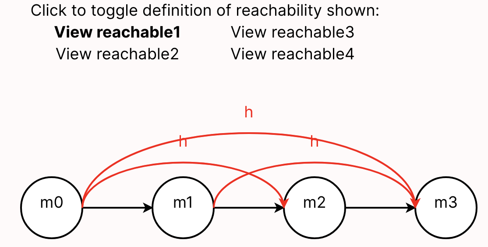

# Introduction to Modeling (Part 2)

## Logistics

The first lab starts today! The starter model is a _variant_ of the livecode that we produced in class. It also contains a possible version of the `move` predicate we started writing. 

**Please keep Forge updated. You'll want to update it for the lab, today.**

## Project Showcase

Here are a few examples of the sort of thing you'll be able to model in Forge. Of course, these don't cover all possibilities! But they should give you an idea of what you might aim for. 

### Games and Puzzles 


---

<center>

<span style="font-weight:700;font-size:30px">Uno&#8482;</span><br/>(Noah Atanda, Madison Lease, and Priyanka Solanky)</center>

---

<center>

<span style="font-weight:700;font-size:30px">Texas Hold 'em</span><br/>(Matthew Boranian and Austin Lang)</center>

---

<center>

<span style="font-weight:700;font-size:30px">Triple Triad</span><br/>(Nick Bottone, Sebastien Jean-Pierre, and Robert Murray)</center>

---

### Programming Language Concepts

<center>

<span style="font-weight:700;font-size:30px">Rust Lifetimes and Borrowing</span><br/>(Thomas Castleman and Ria Rajesh)</center>

---

### Security Concepts

<center>

<span style="font-weight:700;font-size:30px"><a href="https://cs.brown.edu/~tbn/publications/ssdnk-fest21-forge.pdf">Cryptographic Protocols</a></span><br/>(Abigail Siegel and Mia Santomauro)</center>

---

### Networks and Distributed Systems

<center>

<span style="font-weight:700;font-size:30px">Network Reachability</span><br/>(Tim Nelson and Pamela Zave, for the <a href="https://fm.csl.sri.com/SSFT23/">Formal Methods Summer School</a>)</center>

---

## Where We Left Off

Last time, we started running Forge to get _instances_ that contained well formed tic-tac-toe boards. 

### Modeling More Concepts: Starting Boards, Turns, and Winning

#### Starting Boards

What would it mean to be a _starting state_ in a game? The board is empty:

```forge,editable
pred starting[s: Board] {
  all row, col: Int | 
    no s.board[row][col]
}
```

#### Turns

How do we tell when it's a given player's turn? It's `X`'s turn when there are the same number of each mark on the board:

```forge,editable
pred XTurn[s: Board] {
  #{row, col: Int | s.board[row][col] = X} =
  #{row, col: Int | s.board[row][col] = O}
}
```

The `{row, col: Int | ...}` syntax means a set comprehension, and describes the set of row-column pairs where the board contains `X` (or `O`). The `#` operator gives the size of these sets, which we then compare.

**Question**: Is it enough to say that `OTurn` is the negation of `XTurn`? 

No! At least not in the model as currently written. If you're curious to see why, run the model and look at the instances produced. Instead, we need to say something like this:

```forge,editable
pred OTurn[s: Board] {
  #{row, col: Int | s.board[row][col] = X} =
  add[#{row, col: Int | s.board[row][col] = O}, 1]
}
```

Forge supports arithmetic operations on integers like `add`. While it doesn't matter for this model yet, addition (and other operations) can overflow according to 2's complement arithmetic. For example, if we're working with 4-bit integers, then `add[7,1]` will be `-8`. You can experiment with this in the visualizer's _evaluator_, which we'll be using a lot after the initial modeling tour is done.

(Warning: don't try to use `+` for addition in Forge! Use `add`; we'll explain why later.)

#### Winning the Game

What does it mean to _win_? A player has won on a given board if:
* they have placed their mark in all 3 columns of a row; 
* they have placed their mark in all 3 rows of a column; or
* they have placed their mark in all 3 squares of a diagonal.

We'll express this in a `winner` predicate that takes the current board and a player name. Let's also define a couple helper predicates along the way:

```forge,editable
pred winRow[s: Board, p: Player] {
  -- note we cannot use `all` here because there are more Ints  
  some row: Int | {
    s.board[row][0] = p
    s.board[row][1] = p
    s.board[row][2] = p
  }
}

pred winCol[s: Board, p: Player] {
  some column: Int | {
    s.board[0][column] = p
    s.board[1][column] = p
    s.board[2][column] = p
  }      
}

pred winner[s: Board, p: Player] {
  winRow[s, p]
  or
  winCol[s, p]
  or 
  {
    s.board[0][0] = p
    s.board[1][1] = p
    s.board[2][2] = p
  }
  or
  {
    s.board[0][2] = p
    s.board[1][1] = p
    s.board[2][0] = p
  }  
}
```

We now have a fairly complete model for a single tic-tac-toe board. Before we progress to games, let's decide how to fix the issue we saw above, where our model allowed for boards where a player has moved too often.

Should we add something like `OTurn[s] or XTurn[s]` to our wellformedness predicate? If we then enforced wellformedness for all boards, that would indeed exclude such instances---but at some risk, depending on how we intend to use the `wellformed` predicate. There are a few answers...
* If we were generating _valid boards_, a cheating state might well be spurious, or at least undesirable. In that case, we might prevent such states in `wellformed` and rule it out. 
* If we were generating (not necessarily valid) boards, being able to see a cheating state might be useful. In that case, we'd leave it out of `wellformed`.
* If we're interested in _verification_, e.g., we are asking whether the game of Tic-Tac-Toe enables ever reaching a cheating board, we shouldn't add `not cheating` to `wellformed`---at least, not so long as we're enforcing `wellformed`, or else Forge will never find us a counterexample! 

**IMPORTANT:** In that last setting, notice the similarity between this issue and what we do in property-based testing. Here, we're forced to distinguish between what a reasonable _board_ is (analogous to the generator's output in PBT) and what a reasonable _behavior_ is (analogous to the validity predicate in PBT). One narrows the scope of possible worlds to avoid true "garbage"; the other checks whether the system behaves as expected in one of those worlds.

We'll come back to this later, when we've modeled full games. For now, let's separate our goal into a new predicate called `balanced`, and add it to our `run` command above:

```forge,editable
pred balanced[s: Board] {
  XTurn[s] or OTurn[s]
}
run { some b: Board | wellformed[b] and balanced[b]} 
```

To view instances for this new `run` command, select the Execute menu and then `Run run$2`.

If we click the "Next" button a few times, we see that not all is well: we're getting boards where `wellformed` is violated (e.g., entries at negative rows, or multiple moves in one square). 

We're getting this because of how the `run` was phrased. We said to find an instance where _some board_ was well-formed and valid, not one where _all boards_ were. By default, Forge will find instances with up to 4 `Boards`. So we can fix the problem either by telling Forge to find instances with only 1 Board:

```forge,editable
run { some b: Board | wellformed[b] and balanced[b]} 
for exactly 1 Board
```

or by saying that all boards must be well-formed and balanced:

```forge,editable
run { all b: Board | wellformed[b] and balanced[b]} 
```

## Practice with `run`

Let's try some variant `run` commands (inspired by live questions in class).

### No Boards

Is it possible for an instance with _no_ boards to still satisfy constraints like these?

```alloy
run {    
     all b: Board | {
         -- X has won, and the board looks OK
         wellformed[b]
         winner[b, X]
         balanced[b]    
     }
 }
```

<details>
<summary>Think, then click!</summary>
Yes! There aren't any boards, so there's no obligation for anything to satisfy the constraints inside the quantifier. You can think of the `all` as something like a `for` loop in Java or the `all()` function in Python: it checks every `Board` in the instance. If there aren't any, there's nothing to check---return true.
</details>

### Adding More

We can add more constraints if we have a more focused idea of what we want Forge to find. For example, this addition also requires that `X` moved in the middle of the board:

```alloy
run {    
     all b: Board | {
         -- X has won, and the board looks OK
         wellformed[b]
         winner[b, X]
         balanced[b]
         -- X started in the middle
         b.board[1][1] = X
     }
 } for exactly 2 Board
```

Notice that, because we said `exactly 2 Board` here, Forge _must_ find instances containing 2 tic-tac-toe boards, and both of them must satisfy the constraints: wellformedness, `X` moving in the middle, etc.


By the way: `not` also works. So you could ask for a board where `X` _hasn't_ won by adding `not winner[b, X]`. 

You also have `implies` and `iff` (if and only if), although you can still do something like comparing two predicates without `iff` (try, e.g., asking for instances where `A and not B` holds). 

## From Boards to Games

What do you think a _game_ of tic-tac-toe looks like? How should we model the moves between board states?

<details>
<summary>Think, then click!</summary>

It's often convenient to think of the game as a big graph, where the nodes are the states (possible board configurations) and the edges are transitions (in this case, legal moves of the game). Here's a rough sketch:  
    

  
</details>
<br/>

A game of tic-tac-toe is a sequence of steps in this graph, starting from the empty board. Let's model it.

First, what does a move look like? A player puts their mark at a specific location. In Alloy, we'll represent this using a _transition predicate_: a predicate that says when it's legal for one state to evolve into another. We'll often call these the _pre-state_ and _post-state_ of the transition:

```alloy
pred move[pre: Board, row: Int, col: Int, p: Player, post: Board] {
  // ...
}
```

What constraints should we add? It's useful to divide the contents of such a predicate into:
* a _guard_, which allows the move only if the pre-state is suitable; and 
* an _action_, which defines what is in the post-state based on the pre-state and the move parameters.
 
For the guard, in order for the move to be valid, it must hold that in the pre-state:
* nobody has already moved at the target location; and
* it's the moving player's turn.

For the action:
* the new board is the same as the old, except for the addition of the player's mark at the target location.

Now we can fill in the predicate. Let's try something like this:

```alloy
pred move[pre: Board, row: Int, col: Int, p: Player, post: Board] {
  -- guard:
  no pre.board[row][col]   -- nobody's moved there yet
  p = X implies XTurn[pre] -- appropriate turn
  p = O implies OTurn[pre]  
  
  -- action:
  post.board[row][col] = p
  all row2: Int, col2: Int | (row!=row2 and col!=col2) implies {        
     post.board[row2][col2] = pre.board[row2][col2]     
  }  
}
```

There are many ways to write this predicate. However, we're going to stick with this form because it calls out an important point. Suppose we had only written `post.board[row][col] = p` for the action, without the `all` on the next following lines. Those added lines, which we'll call a _frame condition_, say that all other squares remain unchanged; without them, the contents of any other square might change in any way. Leaving them out would be what's called an _underconstraint bug_: the predicate would be too weak to accurately describe moves in tic-tac-toe. 

**Exercise**: comment out the 3 frame-condition lines and run the model. Do you see moves where the other 8 squares change arbitrarily?

**Exercise**: could there be a bug in this predicate? (Hint: run Forge and find out!)


